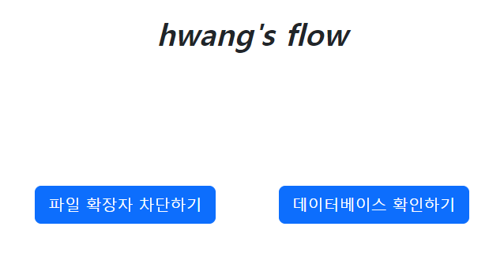
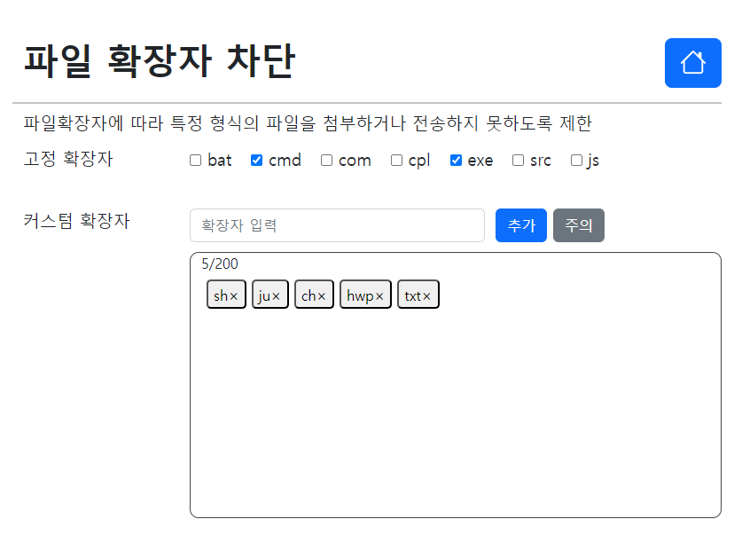
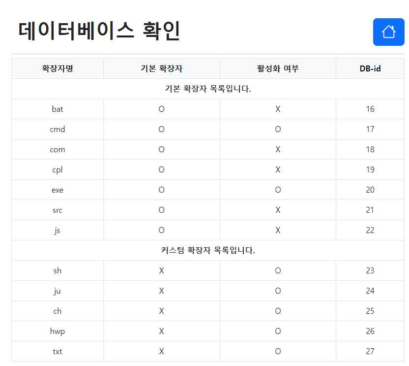

## 파일 확장자 차단 페이지 설명
페이지 접속 주소는 [http://ec2-3-39-165-43.ap-northeast-2.compute.amazonaws.com](http://ec2-3-39-165-43.ap-northeast-2.compute.amazonaws.com)입니다.

웹 서버 운영을 위해 Docker와 AWS의 EC2, AWS RDS(Mysql)를 사용했습니다.

백엔드 서버는 Java-Spring을 사용하여 REST API를 구현하였고,  
프론트엔드 서버는 HTML, CSS, Bootstrap 그리고 Javascript를 사용하여 구현했습니다.

## 데이터 베이스 설정
**<데이터 베이스 DDL>**  
Default(고정) 확장자와 Custom 확장자 구분을 위해 default_check(boolean) 컬럼을 사용하였고,  
Default(고정) 확장자의 체크여부(활성화여부)를 표시하기 위해 active_check(boolean) 컬럼을 사용했습니다.
~~~
DROP TABLE IF EXISTS extension;

CREATE TABLE extension(
    id BIGINT AUTO_INCREMENT PRIMARY KEY,
    extension_name VARCHAR(255) NOT NULL,
    default_check TINYINT(1) NOT NULL,
    active_check TINYINT(1) NOT NULL
);
~~~

## 메인 페이지 설명 
'파일 확장자 차단하기' 버튼을 클릭하면 핵심 과제인 확장자 차단 페이지로 이동합니다.  
'데이터베이스 확인하기' 버튼을 클릭하면 확장자 차단 결과과 반영된 DB 정보를 보여줍니다.

## 확장자 차단 페이지 설명
 

**< 1. 고정 확장자 정보 표시하기>**  
백엔드 서버를 통해 DB에서 고정 확장자 정보를 직접 가져와 체크여부(active_check)를 파악 후 화면에 표시합니다.  
DB에서 직접 정보를 가져와 표시하기 때문에, 고정 확장자 정보가 증가 해도 
프론트 서버의 코드 변화를 최소화할 수 있습니다.

**< 2. 고정 확장자 체크하기>**  
고정 확장자 옆 체크박스를 클릭하면, DB에서 해당 확장자 정보를 가져와 체크(active)여부를 반대로 변경합니다.  

**< 3. 커스텀 확장자 추가하기>**  
커스텀 확장자를 추가할 때 고려해야할 규칙이 있습니다.
- 이름 규칙(확장자명은 20자 이하의 영어 소문자와 숫자만 등록이 가능)
- 중복된 확장자는 등록 불가
- 커스텀 확장자 개수는 200개 이하로 등록 가능
- 입력한 대문자는 소문자로 자동 변경되고, 빈칸은 자동으로 제거하여 저장 ex) 'A Z a z' -> 'azaz'으로 변경되어 저장  

해당 규칙을 어기게 되면 백엔드 서버는 그에 맞는 에러 Response를 전달하고 그 정보를 받아서 
에러 메시지를 알림창으로 표시합니다.  
모든 규칙을 지킨 확장자명을 추가하면 커스텀 확장자 정보를 DB에 저장합니다.

**< 4. 커스텀 확장자 표시하기 & 삭제하기>**  
DB에 저장되어 있는 Custom 확장자 정보를 백엔드 서버에서 요청합니다.  
해당 정보로 확장자 개수와 x표시 포함된 확장자 이름 버튼을 동적으로 생성합니다. 

x표시가 포함된 확장자 이름 버튼을 클릭하면 DB에서 해당 확장자 정보를 삭제하고 화면을 reload합니다.

## 데이터베이스 확인 페이지 설명
파일 확장자 차단 서비스가 적용된 데이버 베이스 정보를 고정, 커스텀을 구분하여 테이블로 나타냅니다.

